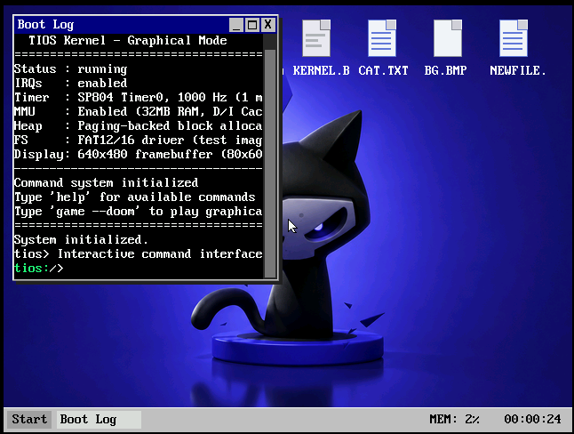
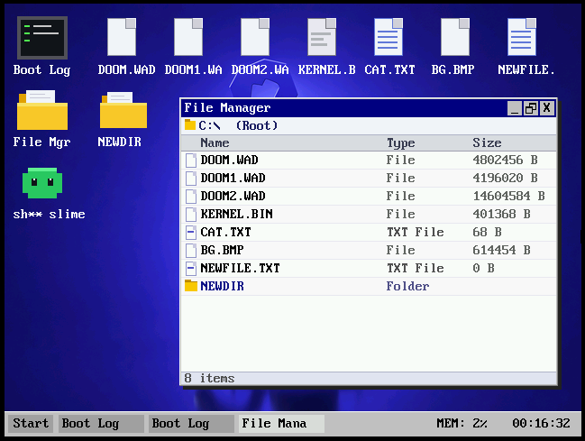
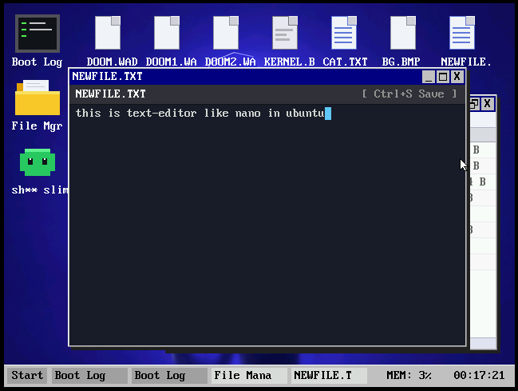
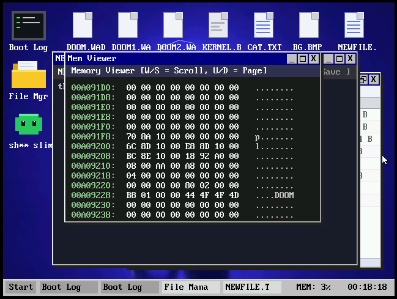
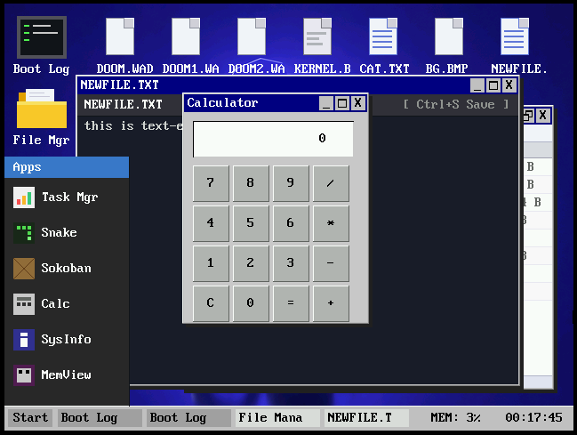
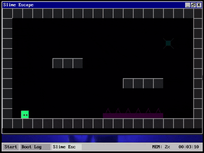

<div align="center">
  <h1>T-OS (Tios)</h1>
  
  <p>
    <b>A lightweight, custom bare-metal operating system built from scratch for ARM devices.</b>
  </p>
  
  <p>
    
    
    
    
  </p>
</div>

---

Hey there! Welcome to T-OS.

I started this project because I believe the best way to really understand computers isn't just to read textbook theory—it's to roll up your sleeves and build the layers yourself. T-OS is a custom, bare-metal operating system built entirely from scratch. What started as a simple terminal experiment to learn low-level systems, graphics, and memory management has evolved into something I'm really proud of. 

Lately, I've completely revamped the OS! It now features a proper **Compositing Window Manager** with a fully functional desktop environment. You can drag windows around, click on desktop icons, browse files with a graphical file manager, write in the text editor, and seamlessly switch between multiple apps using the new taskbar and start menu. The entire codebase has also been restructured to have a clean, modern architecture separating the core kernel logic, UI rendering, user apps, and drivers.

## Features

- **Window Manager:** Fully composited GUI with draggable windows, overlapping support, minimize/maximize capabilities, and a responsive mouse cursor.
- **Desktop Environment:** Interactive desktop with filesystem icons, a start menu, taskbar with a clock, and real-time memory usage tracking.
- **Built-in GUI Apps:** Comes natively with a File Manager, Text Editor, Calculator, Image Viewer, System Info, Task Manager, Memory Viewer, and a Terminal!
- **Core System:** Custom bootloader, FAT16 filesystem support, page-based memory allocator, and a multi-task scheduler.
- **Gaming:** Native support for playing DOOM and Slime Escape in their own windows!
- **Networking:** Experiments with lwIP for networking connectivity.

## Screenshots

### Desktop & Window Management


### Built-in Applications

**File Manager**
<br>


**Text Editor**
<br>


**Memory Viewer**
<br>


**Calculator**
<br>


### Games

**DOOM**
<br>


**Slime Escape**
<br>


## Requirements

To compile and run T-OS locally, you will need the following tools installed on your system:
- **ARM GCC Toolchain:** `arm-none-eabi-gcc`, `arm-none-eabi-ld`, `arm-none-eabi-objcopy`
- **QEMU:** `qemu-system-arm` (Specifically for the `versatilepb` machine emulation)
- **Make:** GNU Make for the build system.

## Build & Run

It's extremely easy to get the OS running locally. First, compile the OS:

```bash
make clean
make
```

To run it in full graphics mode:

```bash
make qemu-gfx
```

## Stack

- **C** (Core kernel and apps)
- **ARM Assembly** (Bootloader and low-level context switching)
- **QEMU** (Emulation)
- **lwIP** (Networking)
- **FATFS** (Filesystem)

## Thanks

Special thanks to Cursor Agent for helping debug endless crashes, linker issues, memory bugs, and random kernel failures during development.

## Contact

- **Website:** [offday.space](https://offday.space)
- **LinkedIn:** [Shreyash Wanjari](https://in.linkedin.com/in/shreyashwanjari)
- **Email:** shreyash@offday.space

## Repository

[https://github.com/shadcy/TOS](https://github.com/shadcy/TOS)
