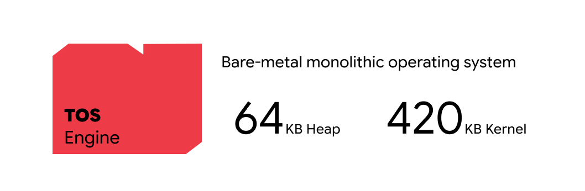
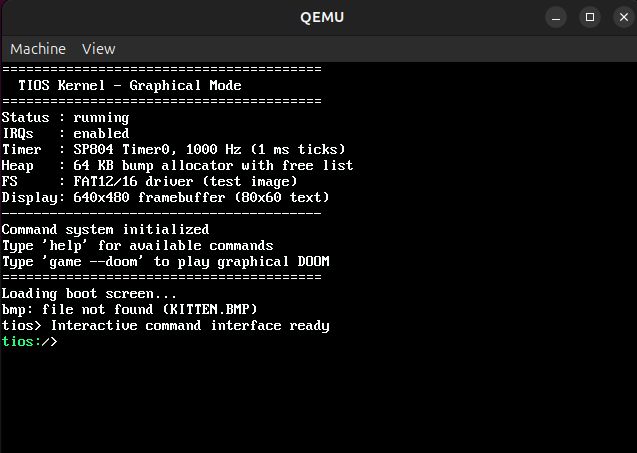
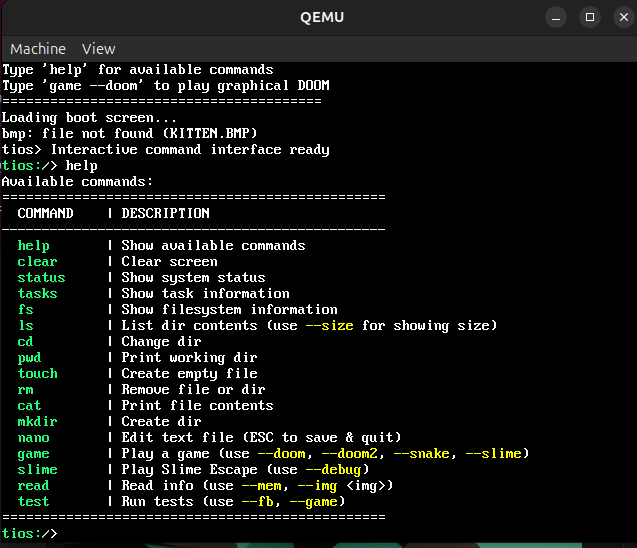
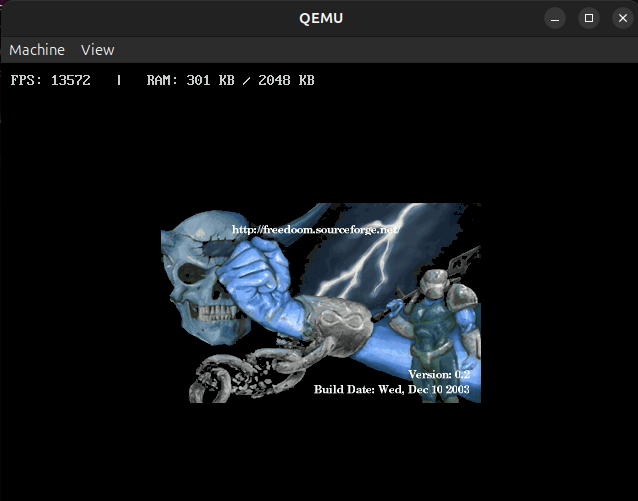
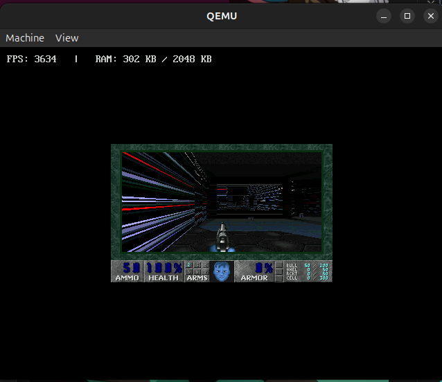
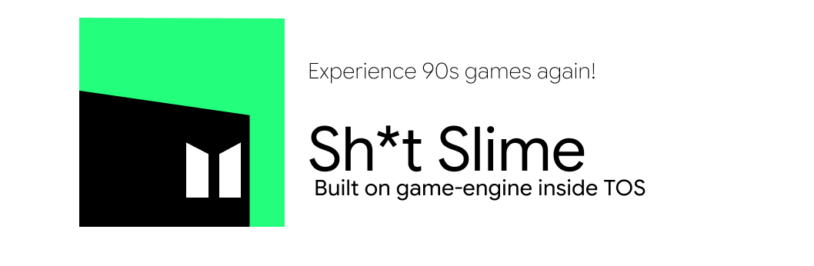

# TOS

TOS is a custom operating system built from scratch for learning low level systems, graphics, memory management and networking by actually building them instead of reading about them. the project focuses on keeping things simple, readable and hackable while still being capable of running graphical applications like DOOM inside QEMU.

## Screenshots

### Boot Screen & CLI



### Games (DOOM & Slime Escape)




## Features

- custom bootloader
- framebuffer graphics
- terminal + shell
- FAT16 filesystem support
- memory allocator
- keyboard input
- basic task scheduler
- networking experiments with lwIP
- DOOM support inside QEMU
- ARM based development environment

## Build

```bash
make
make qemu
```

graphics mode:

```bash
make qemu-gfx
```

## Stack

- C
- ARM Assembly
- QEMU
- lwIP
- FATFS

## Why

TOS exists because the best way to understand computers is to build the layers yourself.

```txt
boot → kernel → graphics → shell → doom
```

## Thanks

special thanks to Cursor Agent for helping debug endless crashes, linker issues, memory bugs and random kernel failures during development.

## Contact

website: https://offday.space  
linkedin: https://in.linkedin.com/in/shreyashwanjari  
mail: shreyash@offday.space

## Repository

https://github.com/shadcy/TOS
