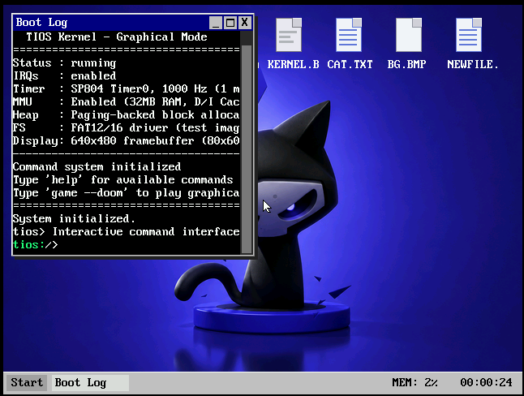
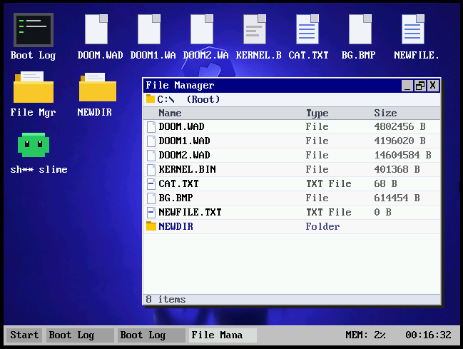
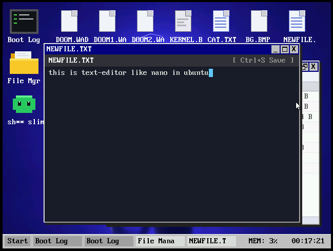
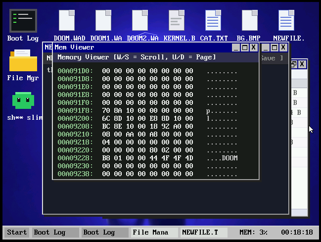
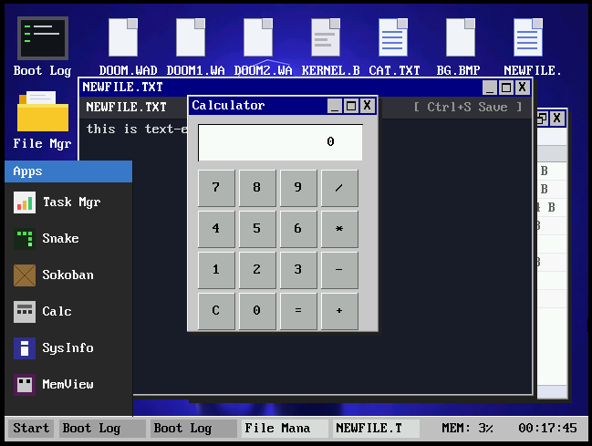
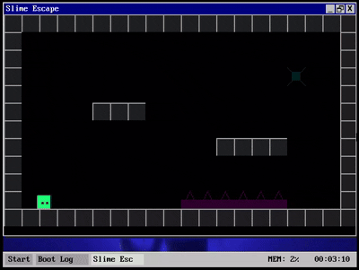

<div align="center">
  <h1>STAX (STAX)</h1>
  
  <p>
    <b>A lightweight, custom bare-metal operating system built from scratch for ARM devices.</b>
  </p>
  
  <p>
    
    
    
    
    
  </p>
</div>

---

**STAX (STAX)** is a lightweight, bare-metal operating system built from scratch for the ARM architecture. Designed as an experimental systems programming project, STAX implements foundational kernel mechanics without relying on existing third-party abstractions.

The project demonstrates a complete vertical stack—from a custom assembly bootloader and low-level hardware drivers to a preemptive task scheduler, a page-based memory allocator, a fully composited graphical window manager, and a production-grade **Secure Firmware Update** system. STAX enforces a clean architectural separation, decoupling hardware interfaces from core kernel logic and user-space applications.

## Core Architecture & Features

- **Boot Sequence & Initialization:** Features a custom assembly bootloader (`Ignition`) that establishes the initial stack pointer, configures ARM CPU operating modes, sets up the interrupt vector table, and securely hands off execution to the C-based kernel.
- **Memory Management (MMU):** Implements a robust page-based memory allocator to map virtual addresses to physical RAM, alongside a custom kernel heap manager (`kmalloc`/`kfree`) to handle dynamic memory allocation safely without leaks.
- **Interrupts & Task Scheduling:** Utilizes the PL190 Vectored Interrupt Controller (VIC) and SP804 Timer to drive a preemptive, multi-tasking scheduler. The kernel manages concurrent tasks, yielding and distributing CPU cycles dynamically.
- **Hardware Drivers:** Bare-metal, from-scratch driver implementations for the ARM VersatilePB board, interfacing directly with memory-mapped I/O registers for the PL050 (Keyboard/Mouse interface), PL110 (Color Framebuffer), and SMC91C111 (Ethernet).
- **Storage & Filesystem:** Integrates the FAT16 filesystem layer on top of a PL181 SD card block driver. This allows the OS to persist user data, read game assets, and manage file I/O operations reliably.
- **Windowing System (Horizon):** A lightweight, compositing Window Manager built directly on the kernel's framebuffer abstraction. It features double-buffering to prevent tearing and provides full window controls (minimize, maximize/restore with `Ctrl+F`, close, dragging, and desktop context menus).
- **Secure Firmware Updates (Escape-Velocity):** A highly resilient A/B dual-slot firmware lifecycle platform. Firmware payloads (`.stax`) are cryptographically verified using **Ed25519** signatures and SHA-256 hashing. It features monotonic version rollback protection, atomic metadata syncing, and a built-in boot watchdog that automatically recovers from corrupted OTA updates or simulated power-loss events.

## Performance & Benchmarking

STAX includes a custom-built, native profiling suite to measure kernel mechanics at microsecond precision (using the SP804 Timer). Benchmarked on QEMU (ARM926EJ-S), the system achieves the following critical metrics:

- **Context Switching:** Highly optimized assembly-level switcher (`vectors.s`) achieving **~16 µs** latency per switch (highly competitive with RTOS standards).
- **Memory Allocation:** $O(1)$ median latency (**1 µs**) for `kmalloc`/`kfree` with dynamic block coalescing. 
- **Filesystem I/O:** PL181 SD card + FAT16 driver sustains **1.9 MB/s Read** and **~500 KB/s Write** throughput on large sequential blocks.
- **Graphics Bandwidth:** Custom MMU configurations (Non-Cacheable + Bufferable) allow the Window Manager to achieve a **927 MB/s memory fill rate**, pushing 640x480 frames at almost 300 FPS.
- **Footprint:** The entire compiled kernel (`kernel.bin`) is incredibly lean, weighing in at just **~430 KB**.

## Screenshots

### Desktop & Window Management


### Built-in Applications

**File Manager**
<br>


**Text Editor**
<br>


**Memory Viewer**
<br>


**Calculator**
<br>


**Secure Firmware Viewer**
<br>
A built-in utility to inspect and cryptographically verify `.stax` OTA payloads directly from the graphical UI before installation.

### Engine Execution (DOOM)

**DOOM**
<br>


**Slime Escape**
<br>


---

## Booster Suite (Containerized Sandbox)

To prevent toolchain collisions and isolate emulation from your host system, STAX includes **Booster Suite**, an isolated Docker/Podman development container with full graphical X11 forwarding and audio support.

### Prerequisites

- **Docker** (or Podman):
  ```bash
  sudo apt update && sudo apt install -y docker.io
  sudo usermod -aG docker $USER
  ```

### Quick Start (One Command)

Launch the sandbox shell with automatic GUI display forwarding:

```bash
./docker-run.sh
```

Inside the Booster sandbox:
```bash
make clean-all
make
make qemu-gfx
```

You can also run build commands directly from the host:
```bash
./docker-run.sh make
./docker-run.sh make qemu-gfx
```

---

## Native Host Requirements (Optional)

If you prefer building directly on your host system without Docker:
- **ARM GCC Toolchain:** `gcc-arm-none-eabi`, `binutils-arm-none-eabi`, `libnewlib-arm-none-eabi`
- **QEMU:** `qemu-system-arm`, `qemu-system-gui` (targeting `versatilepb`)
- **Tools:** `make`, `mtools`, `dosfstools`, `python3`, `gdb-multiarch`

Install on Ubuntu/Debian:
```bash
sudo apt update && sudo apt install -y \
    build-essential gcc-arm-none-eabi binutils-arm-none-eabi libnewlib-arm-none-eabi \
    qemu-system-arm qemu-system-gui mtools dosfstools python3 gdb-multiarch
```

---

## GPOS Evolution Roadmap

STAX is transitioning from an RTOS-style monolithic kernel into a full-fledged **General Purpose Operating System (GPOS)** across 5 engineering phases:

```
┌───────────┐      ┌───────────┐      ┌───────────┐      ┌───────────┐      ┌───────────┐
│  Phase 1  │ ──►  │  Phase 2  │ ──►  │  Phase 3  │ ──►  │  Phase 4  │ ──►  │  Phase 5  │
│  Syscalls │      │  4KB MMU  │      │ ELF-32    │      │  VFS &    │      │ Userspace │
│  & USR Ring│     │  Paging   │      │ Loader    │      │  libc     │      │ Compositor│
└───────────┘      └───────────┘      └───────────┘      └───────────┘      └───────────┘
```

1. **Phase 1: System Call Layer & USR Mode Separation**
   - Hardware ring separation via ARM `USR` mode (`0x10`) and `SVC` mode (`0x13`).
   - Software interrupt vector handler (`svc #0`) and dispatch table (`sys_read`, `sys_write`, `sys_yield`, `sys_exit`).
2. **Phase 2: 4KB Two-Level Virtual Memory Paging**
   - L1 Page Directories + L2 Page Tables per process.
   - Higher-half kernel mapping (`0xC0000000`) and isolated user virtual address spaces.
   - Data Abort & Prefetch Abort handlers for demand paging and memory fault safety.
3. **Phase 3: Dynamic ELF-32 Executable Loader**
   - Parse and execute standard standalone `.elf` binaries from disk via `sys_execve()`.
   - Process control blocks (`pcb_t`), process tree, `sys_fork()` / `sys_spawn()`, and `sys_waitpid()`.
4. **Phase 4: Virtual File System (VFS) & User-Space libc**
   - Unified file descriptor table (`open`, `read`, `write`, `close`, `ioctl`).
   - Device nodes (`/dev/fb0`, `/dev/tty0`, `/dev/urandom`, `/dev/null`) and `/proc`.
   - Standard C library support (Newlib / Musl) for cross-compiling unmodified C applications.
5. **Phase 5: User-Space Horizon Compositor & Applications**
   - Decouple the Window Manager into a standalone user-space display server.
   - User-space GUI and CLI tools communicating over IPC sockets and shared memory.

---

## Technical Stack

- **C:** Core kernel logic, memory management, and system services.
- **ARM Assembly:** Bootloader, hardware initialization, interrupt stubs, and context switching.
- **QEMU:** Emulation and hardware virtualization (`versatilepb`).
- **FATFS:** Filesystem abstraction.
- **Cryptography:** Monocypher (Ed25519), SHA-256, CRC-32.

---

## License

This project is licensed under the **GNU General Public License v3.0 (GPLv3)**. See the [LICENSE](LICENSE) file for details.

---

## Contact

- **Author:** [Shreyash Wanjari (Shadcy)](https://in.linkedin.com/in/shreyashwanjari)
- **Email:** shreyashwanjari5162@gmail.com
- **Repository:** [https://github.com/shadcy/STAX](https://github.com/shadcy/STAX)
