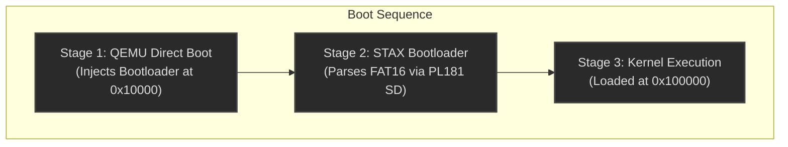
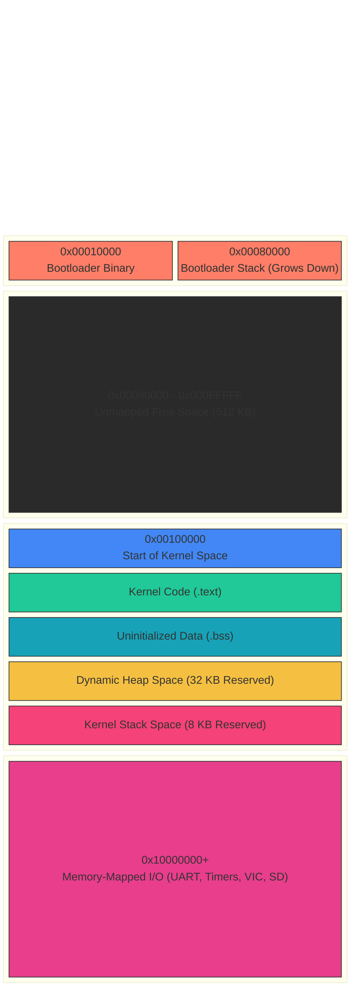

# STAX System Architecture

STAX is a lightweight, bare-metal operating system built for the ARM926EJ-S architecture, specifically targeting the VersatilePB board (run via QEMU). 

Its design philosophy focuses on simplicity, precise memory management, and a robust boot flow utilizing a true FAT16 filesystem.

## 1. High-Level Boot Flow

STAX utilizes a two-stage boot sequence that avoids legacy x86 BIOS/MBR conventions, operating natively as an ARM payload:

1. **Stage 1 (QEMU Injection):** QEMU's `-kernel` flag directly injects `bootloader.bin` into physical RAM at `0x00010000` and passes execution control.
2. **Stage 2 (FAT16 Bootloader):** The bootloader initializes the PL181 SD Card interface, reads the `os.bin` disk image, and parses its FAT16 filesystem. It searches the Root Directory for `KERNEL.BIN` and traces its cluster chain to load the kernel into memory at the 1MB mark (`0x00100000`).
3. **Stage 3 (Kernel Execution):** The system jumps to the kernel entry point, setting up the hardware interrupts, memory manager, and scheduler before launching the interactive shell.

## 2. Memory Architecture

The OS operates entirely within the 256 MB physical SDRAM, while hardware interfaces are accessed via Memory-Mapped I/O.

### Kernel Memory Layout
The kernel enforces strict, mathematically precise static bounds for its core structures to prevent memory collisions:

> [!TIP]
> The `Heap` (32 KB) and `Stack` (8 KB) are statically sized at compile time. This prevents runtime fragmentation from corrupting the execution context.

## 3. Core Subsystems

Once the kernel takes control, it initializes the following core components:

* **Hardware Drivers:** 
  * `UART0` for the interactive console.
  * `SP804 Dual Timer` configured for 10Hz (100ms) ticks.
  * `Vectored Interrupt Controller (VIC)` for IRQ routing.
* **Memory Manager:** Uses a bump allocator for fast initial allocations, seamlessly falling back to a free-list system when memory is freed, ensuring long-term stability within the 32 KB heap limit.
* **Scheduler:** A round-robin task scheduler driven by the 10Hz timer ticks, capable of multiplexing lightweight kernel tasks.
* **Command Shell:** An interactive interface allowing the user to read raw memory bytes, query system uptime, and interact with the virtual filesystem.
